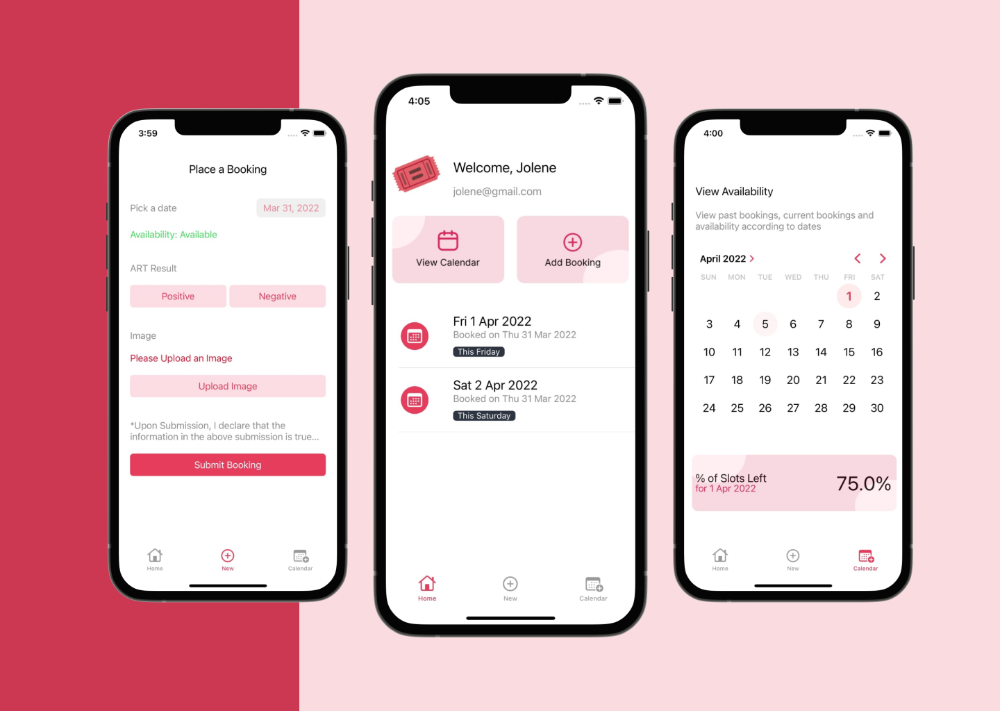
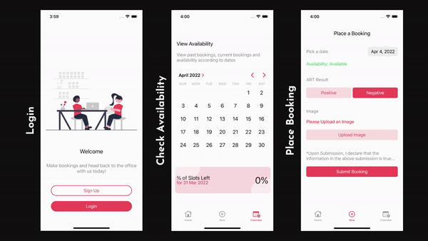
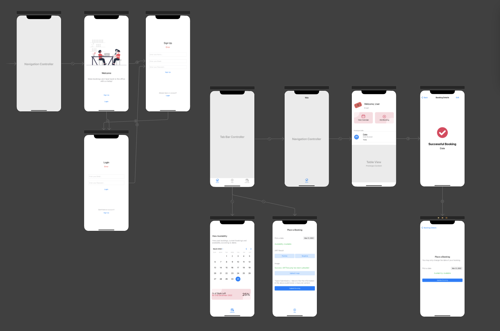

<div align="center">
  <a href="https://github.com/jolenechong/bookingApp">
    
  </a>

<h3 align="center">Swift Booking App</h3>

  <p align="center">
    A booking app to allow staff to book a slot to return to the office only with a negative ART test and if office is below 50% capacity
    <br />
    <a href="https://vimeo.com/694828075">View Demo</a>
  </p>
</div>

<!-- ABOUT THE PROJECT -->
<div align="center">
  
</div>


## About The Project
Date: March 2022<br>
Demo: <a href="https://vimeo.com/694828075">View Demo</a>

<br><br>

After the pandemic, 50% of employees who can work from home are allowed to return to the
workspace. Those who report to work onsite are encouraged to self-test via ART. <br>

BookingApp handles bookings so that staff of a company perform the following before returning to the office
- Perform ART and submit results
- Only when submitting a negative result, staff can book a slot before going down to the office.
- The booking will only go through if it doesn’t exceed 50% of current staff count.<br><br>

<br><br>

User Process
1. Sign up/ Login with an email and password
2. View/Edit/Delete Current bookings with the home page
  - Swipe left to delete booking
  - Click to show a screen of the confirmed booking which will be used at the entrance of the office for proof of booking
  - Staff can edit bookings with a button at the top right but bookings can only be changes to a date within 7 days of when the booking was placed
3. Create New Bookings with the new booking page
  - Staff will enter the date they want to return to the office, ART test results and ART test image
  - New bookings can only be created if current staff count is below 50%
4. View availability and bookings by date with the calendar page


<br>


Assumptions
- Each staff can only create one booking for one day (hence no timeslots)
- Staff can only view upcoming bookings, not past bookings
- ART test results only stays valid for 7 days (staff can only book 7 days in advance)
- All staff will show proof of booking at the entrance of the building
- Bookings will only be accepted with a Negative ART Result

## Built With

* [Swift](https://developer.apple.com/swift/)
* [Xcode](https://developer.apple.com/xcode/)
* [Firebase](https://firebase.google.com) Firebase Authentication, Storage, Firestore


<!-- GETTING STARTED -->
## Getting Started

* Clone and run the projec easily with xcode.
 ```sh
 git clone https://github.com/github_username/repo_name.git
 ```
 
 * Connect Firebase and upload your ```GoogleService-Info.plist``` file


<!-- ROADMAP -->
## Roadmap

- [ ] Firebase Authentication
- [ ] Add, Edit, Delete Bookings
- [ ] View availability
- [ ] Cleaning up UI
- [ ] Testing the App and fixing bugs


<!-- CONTACT -->
## Contact

Jolene - [jolenechong7@gmail.com](mailto:jolenechong7@gmail.com)

Project Link: [https://github.com/jolenechong/bookingApp](https://github.com/jolenechong/bookingApp)